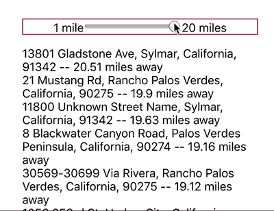
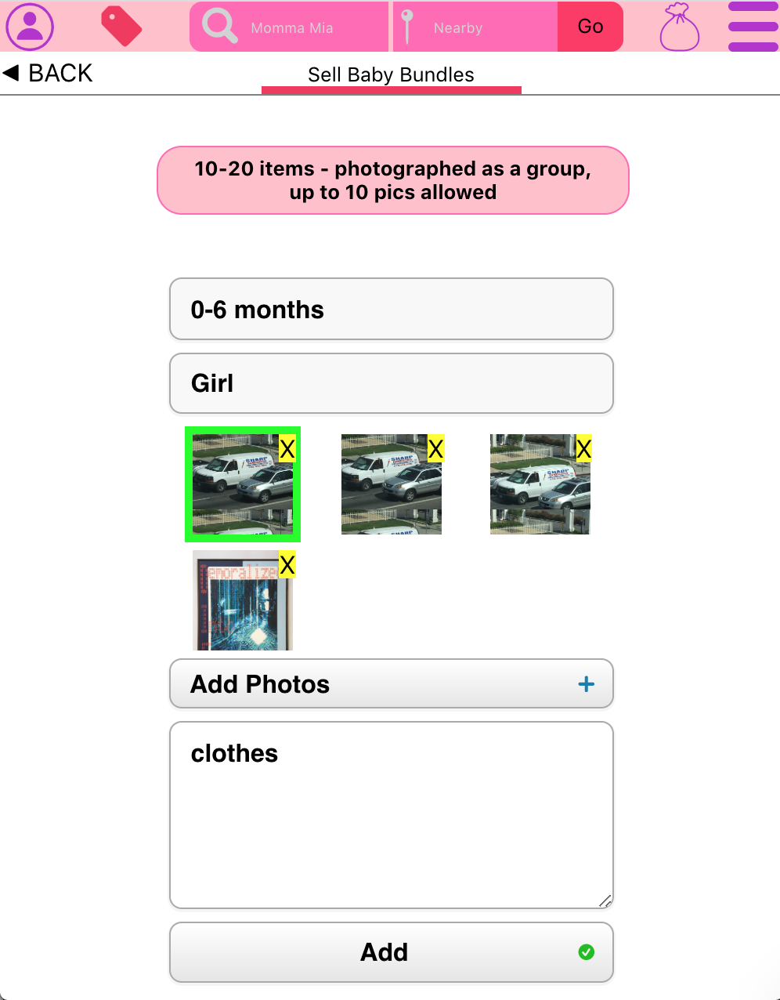

# Momma Mia 
**Momma Mia** is a marketplace for buying bundles of baby clothes second hand.

## Buy Locally 

**Momma Mia** Implements [KDBush](https://github.com/mourner/kdbush) for range search feature 
 

## or Buy Remotely
if the user that you are buying from lives outside of your *pickup radius* arrange to have the bundle shipped

## Post Bundles  

## Search for specific types of clothes or browse bundles 

